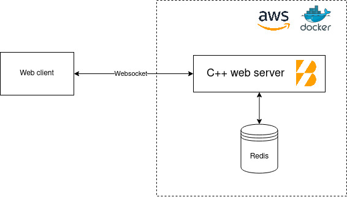

= BoostServerTech Chat
Rubén Pérez (@anarthal)

Welcome to BoostServerTech Chat documentation!

Be sure to check out our http://16.171.43.27/[live demo]!

== The BoostServerTech project

This repository contains a chat application written in pass:[C++]. It's part of the
https://docs.google.com/document/d/1ZQrod1crs8EaNLLqSYIRMacwR3Rv0hC5l-gfL-jOp2M[BoostServerTech]
series, a collection of projects to showcase
how the Boost libraries can be used together to build high-performance
web servers.

If you're a developer looking for inspiration, this project can be useful
to you in a number of ways:

* It demonstrates how to use Boost libraries for server-side, asynchronous
  networking.
* It follows Boost and pass:[C++] best practices.
* It can save you setup time by providing a project skeleton you can use for
  your own app. This includes server boilerplate code, a working client,
  tests and CI/CD scripts. You can fork the project, modify it to match
  your needs, and xref:03-fork-modify-deploy#[go live in minutes].

If you're a Boost contributor, want to become one, or just want to exercise
your C++ abilities, this project is a good place to start. Please read
the xref:contributing[contributing] section for details.

== A group chat app

The best way to know the app is to http://16.171.43.27/[try it!].

Here are some of the current and planned features:

- Users send and receive messages in group chats called "chat rooms".
  Point-to-point messaging is not currently planned.
- Users can create accounts and log in using an email and a password.
- Chat rooms are currently statically defined in the server, but will be
  dynamic in the future.

== Technical overview

The following diagram presents an overview of the application architecture:



- There is a single, pass:[C++] based webserver.
- Messages are stored in a Redis database, configured with persistence enabled.
- Objects that don't require low-latency access (such as users) are stored in
  MySQL.
- The front-end is web-based, written in https://react.dev/[React].
- Front-end and back-end communicate using a REST API and websockets.
- The front-end is served by the pass:[C++] server as regular, static files.
- The pass:[C++] server and the two database servers are deployed as
  Docker containers. Deployments are performed automatically by
  a GitHub Actions pipeline.
- The project includes a test suite, including server and client unit tests,
  as well as Python-based integration tests.

You can learn more about the project architecture by reading
xref:01-architecture.adoc[this section].

== Running the application locally

If you've got Docker Compose installed in your machine,
you can build and run the entire application by just typing in a terminal:

[source,bash]
```
$> docker compose up --build
```

If you want to set up a more traditional development environment on your local
machine, check xref:02-local-dev.adoc#[this section] out.

== Instant Deployment: From GitHub Fork to Public Server in Minutes

Would you like to have your own working copy of our application? We've
enabled a super-simple CI/CD workflow that lets you fork the repository,
modify what you want and deploy it to AWS in minutes. Check out
xref:03-fork-modify-deploy.adoc#[this section] to learn more.

[#contributing]
== Contributing

We always welcome contributions! As a fist step, please
https://cpplang.slack.com/archives/C05MLSQGA01[join our Slack discussion group]
and have a look at
https://github.com/anarthal/servertech-chat/issues[the open issues].

You can contribute by submitting PRs, writing docs or tests, or opening
issues if you've found a bug.

If you want to share any piece of feedback with us, either positive or negative,
you can do so by commenting on
https://github.com/anarthal/servertech-chat/issues/40[this issue].

If you're a Boost author and you would like to showcase your library, you can
fork this project and modify it to build your own BoostServerTech application.
